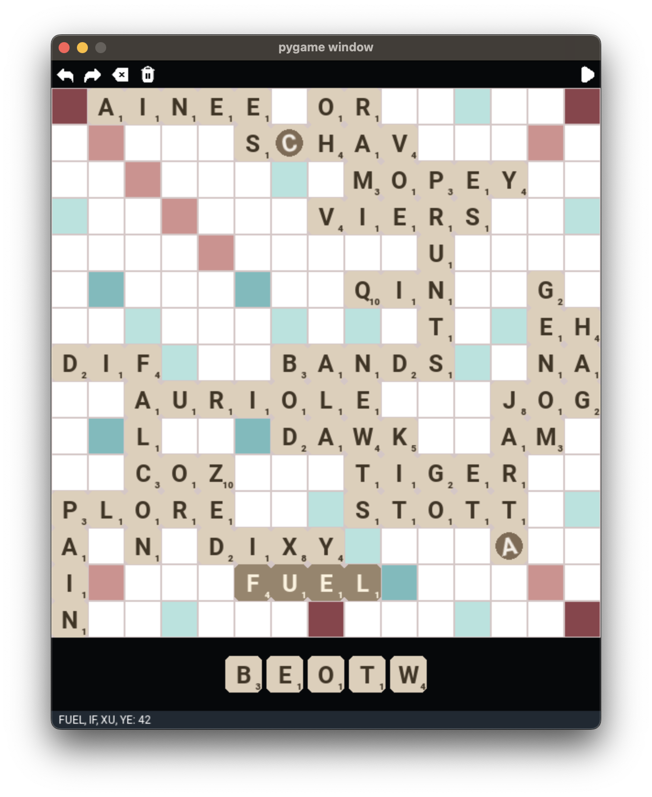

# scrabble-solver

A tool that finds the highest-scoring move in a game of scrabble.

Based on the 1988 paper ["The World's Fastest Scrabble Program"](https://www.cs.cmu.edu/afs/cs/academic/class/15451-s06/www/lectures/scrabble.pdf) by Appel and Jacobson.
